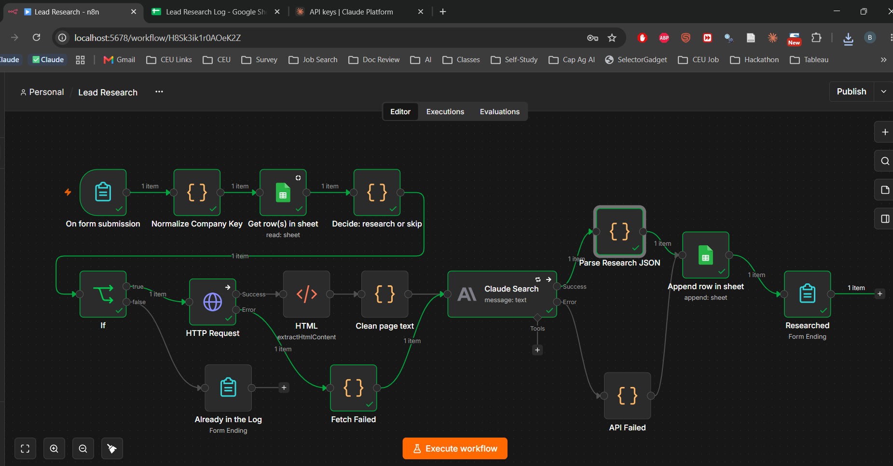
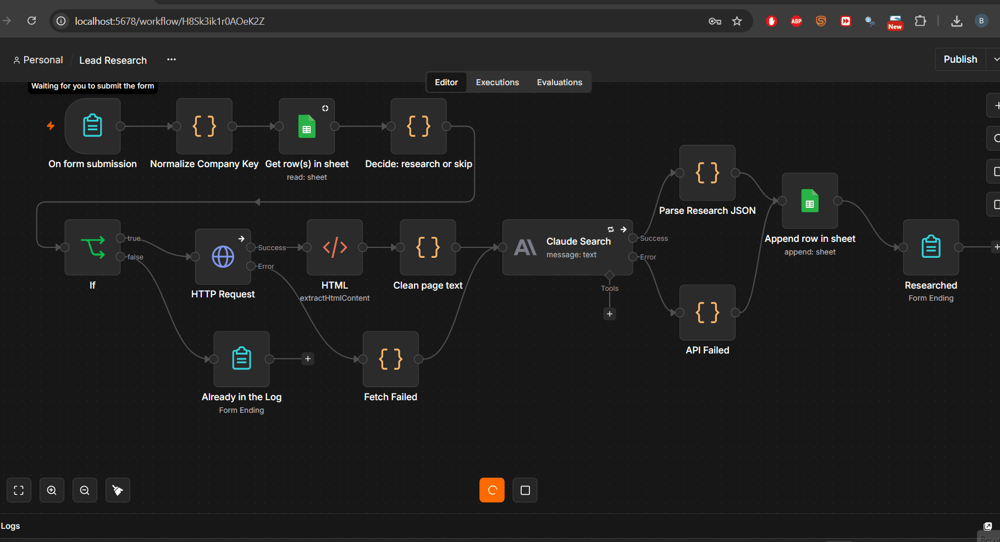

# n8n lead research project

## Context & Use Case

Built as a hands-on project to learn n8n by automating lead enrichment. The test case focuses on Hungarian subcontractors, a sector where market players range from large enterprises with rich digital footprints to highly skilled sole proprietorships (egyéni vállalkozók) with almost no web presence. Both are viable vendors, making standard LLM scraping unreliable without custom grounding and source-tiering rules.

This self-hosted n8n workflow turns a company name into a sourced research record. You submit a company name via a simple form, with an option to also add a website and a city. Claude Sonnet 5 reads the company's homepage if available and searches the web, returns structured JSON, and the workflow writes one row to a Google Sheet standing in for a CRM. The workflow de-duplicates against companies already in the sheet, indicates when sources are thin, and records where every identity field came from.

Fifteen nodes, one LLM call per lead.


---



## Node Functions

| Node | What it does |
| --- | --- |
| On form submission | n8n-hosted form: company name (required), website, city, and a re-research override |
| Normalize Company Key | Strips accents and common legal suffixes in English, Hungarian and German to a matching key. `Törő Épületgépészeti Kft.` becomes `toro-epuletgepeszet` |
| Get row(s) in sheet | Looks up that now normalized company key in the tracking Google Sheet, referred to below as the log |
| Decide: research or skip | Applies a 30 day freshness window, and records why; if the user has selected Yes on the re-research override in the form, that manual override is honored |
| If | New, stale, or forced goes to research. Everything else goes to a completion page that says when it was last done |
| HTTP Request | Fetches the homepage, if a URL has been provided. 15 second timeout, identifying User-Agent, failures routed to an error output rather than stopping the run |
| HTML | Extracts the readable text from the body of the fetched page, discarding tags, scripts, and navigation elements |
| Clean page text | Drops menu fragments and duplicate lines, keeps lines that read as prose, truncates to 6,000 characters, and records the original length so a truncated run is visible rather than silent |
| Fetch Failed | Catches the HTTP node's error output and emits empty page text. This way a missing, dead, slow, or blocking site results in a search-only run instead of stopping the workflow |
| Claude Search | One call to Claude Sonnet 5 with web search enabled, capped at 3 searches, returning fixed-key JSON |
| Parse Research JSON | Extracts and validates the JSON, flattens it, and derives the cost, source, and identity fields |
| API Failed | Catches the `Claude Search` node's error output after both attempts fail and writes an `api_error` row, so failure produces a record rather than leaving a silent gap |
| Append row in sheet | Writes one row to the log, including rows for runs that failed |
| Researched | Form completion page for a successful run, reporting the company, research status, number of searches, and estimated cost |
| Already in the Log | Form completion page for a skipped run, reporting when the company was last researched and how to force a re-run |

Sample output for 8 CEE companies is in [docs/sample-output.csv](docs/sample-output.csv).

## Setup

Requires Docker, an Anthropic API key, and a Google account.

```
docker run -d --name n8n -p 5678:5678 -v n8n_data:/home/node/.n8n \
  -e GENERIC_TIMEZONE="Europe/Budapest" -e TZ="Europe/Budapest" \
  docker.n8n.io/n8nio/n8n
```

Open http://localhost:5678, create the local owner account, and import `workflow/lead-research.json`.

Then configure two credentials and one sheet:

1. Anthropic API credential, using your own key.
2. Google Service Account credential. Create a project in Google Cloud, enable the Sheets API, create a service account, and download its JSON key. Paste the `client_email` and `private_key` into n8n. Access is granted by sharing the sheet with the service account's email address.
3. Create a Google Sheet with the header row matching the field names emitted by `Parse Research JSON`, and share it with the service account's email address as an Editor. Replace `YOUR_SHEET_ID_HERE` in the two Google Sheets nodes with your own sheet URL.

Set the Google Sheets nodes' Cell Format to "Let n8n Format". Otherwise Sheets interprets a leading `+` in a phone number as a formula and writes `#ERROR!`.

## Measurements

Across eight companies:

| | |
| --- | --- |
| Companies researched | 8 |
| Rows in the log | 9, including one `api_error` |
| Median cost per lead | $0.105 |
| Median time per lead | 33 seconds |
| Total for the sample | $0.98 |
| Research status | 6 good, 2 thin |

Cost is dominated by search results entering the context as input tokens, not by the per-search fee. Runs that used 2 searches consumed around 30,000 input tokens; runs that used 3 consumed 55,000 to 60,000, because within a single turn each search iteration resends the previous results. So the lever for cost is how much retrieved content reaches the context, not how many searches happen. At this rate, a thousand leads costs roughly a hundred dollars.

## Design Decisions

- Strict extraction. Without explicit constraints, LLMs default to parametric memory, and can fabricate headcount, industry vertical, and services for non-prominent SMBs. The prompt enforces strict citation-backed extraction: every field must map directly to raw text extracted from the target homepage or retrieved search snippets. Unsubstantiated attributes are explicitly coerced to `null` rather than estimated.

- Decoupling business validity from source coverage. Missing company data often reflects an unoptimized web presence rather than an illegitimate business. This is especially common for small subcontractors, who rely upon word-of-mouth and reputation for new business, rather than online presence. The schema explicitly separates extracted attributes from run metadata. This isolates source accessibility and coverage from the company profile. It also prevents downstream CRM scoring models from treating sparse web footprints as negative business signals.

- Source verification. The schema tracks both declared and actual citations: `sources` captures the URLs Claude claimed to reference, while `sources_retrieved` is read programmatically from the search results in the API response, as well as the homepage the workflow fetched itself. The `sources_unverified` difference between them flags any URL cited but never actually retrieved, as a cheap check on whether the citations are real.

- For legal identifiers, source hierarchy is tiered. Hard corporate identifiers (legal name, registration ID, tax numbers) must originate exclusively from official company registries, authorized data redistributors, or mandatory corporate impressums (legally required for Hungarian business websites). Aggregators, social media profiles, and directories are restricted to secondary corroboration and cannot establish identity fields.

- Canonical keys alongside display formatting. To prevent duplicate records caused by varied punctuation (e.g. `01 09 346276` vs. `01-09-346276`), corporate IDs are stored in dual formats: `registration_number` preserves human-readable spacing, while `registration_number_key` sanitizes the value into a raw alphanumeric string for reliable downstream reconciliation. Uppercasing rather than stripping to digits preserves country prefixes, so the Slovenian VAT number `SI 76619982` becomes `SI76619982`. `SI76619982` and `HU76619982` are different taxpayers, and a digits-only key would have merged them.

- Name normalization stops duplicate runs, while official registry IDs handle legal identity. Company names are messy and change often. Human input introduces everyday variations (someone types without accents, drops legal suffixes like Kft. or GmbH, or uses a marketing name instead of the registered entity). Stripping accents and legal forms catches those obvious overlaps to prevent paying for redundant research runs within the 30-day window. While it won't catch outright typos, it solves the most common input friction. Official state registration numbers remain the only reliable record key once research is complete, but this is not known upon data entry into the form.

- Only successful runs count as prior research. The lookup returns every row for a company key, and the freshness check uses the most recent one with `status: ok`. Without this, a previous failed run would write a row that blocks the retry, resulting in a permanent gap in the data.

- Graceful degradation, diagnostic error capture. Upstream network failures (such as timeouts, 403s, missing URLs) fall back safely to empty text buffers. This allows the workflow to proceed via search rather than crashing. For LLM response errors, raw payloads are logged with `status: parse_error` alongside the model's `stop_reason`. This isolates context-window truncations (e.g., `max_tokens reached`) from schema syntax errors, which simplifies root-cause triage. Also a failed API call (after retry) is captured as an `api_error` row with the error text. Thus both failure classes leave a record.

- Timestamps are stored in UTC and formatted for display.

## Limitations

This project is not:

- a Vendor Master or Account Directory. This workflow writes point-in-time research logs (Leads), not verified master data (Accounts). Information can become stale, and no record here should be used to authorize payments or issue contracts.
- an automated payment/compliance check. Subcontractor onboarding requires formal tax clearance, liability insurance checks, and lead-to-account reconciliation, and all of these processes are deliberately kept outside this intake tool.
- a judgment on business quality. In trade and construction sectors, a thin digital footprint is an artifact of web presence, not operational reliability.

## Production Readiness & Future Improvements

- Pragmatic Homepage Handling: This workflow aims to accelerate human research. It is not intended to act as an all-purpose web crawler. Small-business sites are notoriously unpredictable: many use single-page JavaScript templates where a basic HTTP GET returns blank HTML, while others have navigation menus larger than the token budget. In lieu of complex headless browser scrapers, production improvements would route rendering-heavy URLs through lightweight APIs (like Jina Reader or Firecrawl) or avoid the homepage entirely and rely upon Claude's search tool.

- Registry and Tax Authority Integrations: For hard entity verification, this requires querying official registries directly instead of web scrapers. EU VIES provides a straightforward API to validate VAT numbers. Domestically, the workflow must account for Hungary's dual track: incorporated firms sit in the corporate court registry (cégjegyzék), while sole proprietors (egyéni vállalkozók) reside in NAV's separate EVNY system. Production validation would query NAV's queryTaxpayer API (for known tax numbers) or use a commercial registry aggregator rather than assuming an unlisted trade contractor is invalid.

- Uneven Identifier Coverage: While incorporated firms reliably display their registration and tax numbers in mandatory impressums, the two apparent one-person operations in the sample listed neither. Their identifiers exist, but not on their public pages. Closing this gap requires either collecting the tax number upfront or querying registers by name, which revives fuzzy-matching issues. Hungary does have a mandatory construction contractor register (építőipari kivitelezői nyilvántartás) maintained by MKIK and publicly searchable, covering sole proprietors as well as companies, but other trades fall under profession-specific chambers, so licence verification requires first categorizing the exact trade.

- Controlled Error Recovery: The Anthropic node `Claude Search` retries a failed call once automatically. If both attempts fail, the run writes an `api_error` row carrying the underlying error text. As a result, an infrastructure failure produces a record rather than a silent gap. For invalid model responses, the workflow logs an error row with diagnostic metadata (`status: parse_error`, `stop_reason`) rather than looping. While a production pipeline could add a repair loop, the actual errors encountered (a conversational preamble and output truncation) were resolved structurally by hardening the JSON parser and raising token limits without spending extra API calls.

- Cost and Token Management: Multi-turn web searches get expensive fast because each new search re-sends all previous results back into the model. This roughly doubles token counts from two to three searches. Production workflows could cut this cost by using a cheap filter or small utility model to strip out boilerplate snippets before passing the text to the main LLM.

- Crawler Etiquette & Rate Limiting: The HTTP node identifies itself and uses a 15-second timeout, but it doesn't yet check robots.txt or back off if a site sends a rate-limit warning. Production runs should also cache fetched pages so the workflow doesn't repeatedly download the same website.

## Known Issues

A citation marker occasionally leaks from the model into a `research_notes` value. It is cosmetic and would be stripped in the parse step.

The sample sheet has a duplicated `identity_source` column, left in as exported.

## Scope

Deliberately excluded: no evaluation set, no agent framework, no hosting or tunnelling, no scheduled batch runs.

## Author

Boglarka Petruska  
[LinkedIn](https://www.linkedin.com/in/boglarkapetruska/) • [Portfolio](https://b0glarka.github.io/)